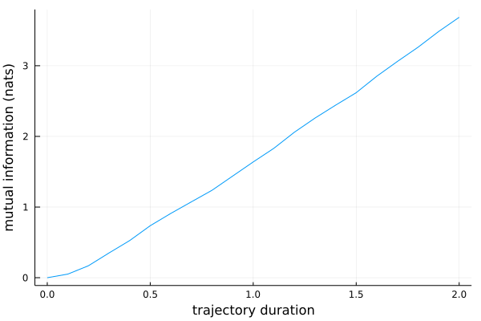

# PathWeightSampling.jl

[](https://github.com/manuel-rhdt/PathWeightSampling.jl/actions/workflows/ci-pipeline.yml)
[](https://codecov.io/gh/manuel-rhdt/PathWeightSampling.jl)
[](https://zenodo.org/badge/latestdoi/268234770)


PathWeightSampling.jl is a Julia package to compute information transmission rates using the novel Path Weight Sampling (PWS) method.

## Documentation

The [documentation for PathWeightSampling.jl](https://manuel-rhdt.github.io/PathWeightSampling.jl/) is hosted on github.

## Installation

For instructions for how to install Julia itself, see the [official website](https://julialang.org).

To install this package, type from the Julia REPL
```julia
julia> import Pkg; Pkg.add("PathWeightSampling")
```

Alternatively, you can install this package by starting Julia, typing `]` and then
```julia
pkg> add PathWeightSampling
```

## Quick Start

After installation, the package can be loaded from directly from julia.
```julia
julia> using PathWeightSampling
```
We then need a *system* of reactions for which we want to compute the mutual information. We can use one of the included example systems, such as a simple model for gene expression.
```julia
julia> system = PathWeightSampling.gene_expression_system()
SimpleSystem with 4 reactions
Input variables: S(t)
Output variables: X(t)
Initial condition:
    S(t) = 50
    X(t) = 50
Parameters:
    κ = 50.0
    λ = 1.0
    ρ = 10.0
    μ = 10.0
```
This specific model is very simple, consisting of only 4 reactions:

- ∅ → S with rate *κ*
- S → ∅ with rate *λ*
- S → S + X with rate *ρ*
- X → ∅ with rate *μ*

S represents the input and X represents the output. The values of the parameters
can be inspected from the output above.
For this system, we can perform
a PWS simulation to compute the mutual information between its input and output trajectories:

```julia
julia> result = mutual_information(system, DirectMCEstimate(256), num_samples=1000)
```

Here we just made a default choice for which marginalization algorithm to use (see [documentation](https://manuel-rhdt.github.io/PathWeightSampling.jl/) for more details).
This computation takes approximately a minute on a typical laptop. The result is a 
`DataFrame` with three columns and 1000 rows:

```julia
1000×3 DataFrame
  Row │ TimeConditional  TimeMarginal  MutualInformation                 
      │ Float64          Float64       Vector{Float64}                   
──────┼──────────────────────────────────────────────────────────────────
    1 │     0.000180898     0.0508378  [0.0, -0.67167, 0.388398, -0.343…
  ⋮   │        ⋮              ⋮                        ⋮
 1000 │     0.00020897      0.0694072  [0.0, 0.254173, 0.362607, 0.2584…
                                                         998 rows omitted
```

Each row represents one Monte Carlo sample.

- `TimeConditional` is the CPU time in seconds for the computation of the conditional probability P(**x**|**s**)
- `TimeMarginal` is the CPU time in seconds for the computation of the marginal probability P(**x**|**s**)
- `MutualInformation` is the resulting mutual information estimate. This is a vector for each sample giving the mutual information for trajectories of different durations. The durations to which these individual values correspond is given by

```julia
julia> system.dtimes
0.0:0.1:2.0
```

So we computed the mutual information for trajectories of duration `0.0, 0.1, 0.2, ..., 2.0`.

We can plot the results (assuming the package Plots.jl is installed):

```julia
julia> using Plots, Statistics
julia> plot(
           system.dtimes,
           mean(result.MutualInformation),
           legend=false,
           xlabel="trajectory duration",
           ylabel="mutual information (nats)"
       )
```



Here we plot `mean(result.MutualInformation)`, i.e. we compute the average of our Monte Carlo samples, which is the PWS estimate for the mutual information.

More examples and a guide can be found in the [documentation](https://manuel-rhdt.github.io/PathWeightSampling.jl/)

## Acknowledgments

This work was performed at the research institute [AMOLF](https://amolf.nl).
This project has received funding from the European Research Council (ERC) under the European Union’s Horizon 2020 research and innovation program (grant agreement No. 885065)
and was financially supported by the Dutch Research Council (NWO) through the “Building a Synthetic Cell (BaSyC)” Gravitation grant (024.003.019).

[](https://www.nwo.nl)
[](https://amolf.nl)
[](https://www.basyc.nl)
